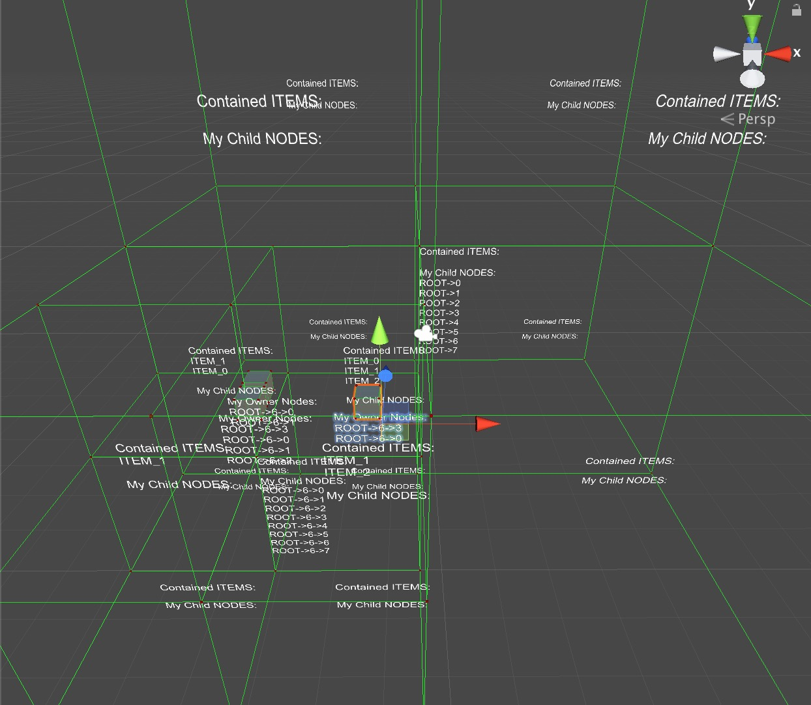
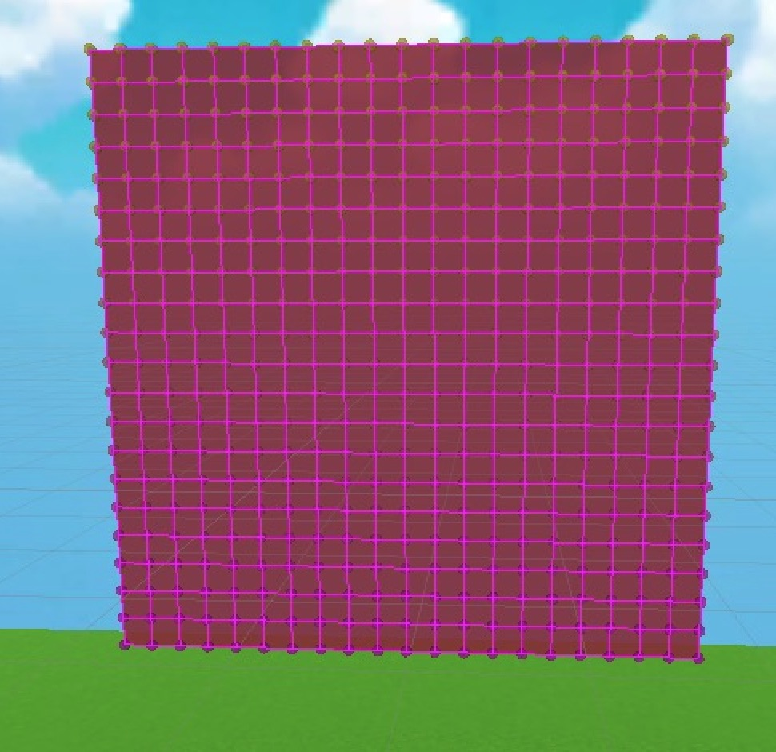
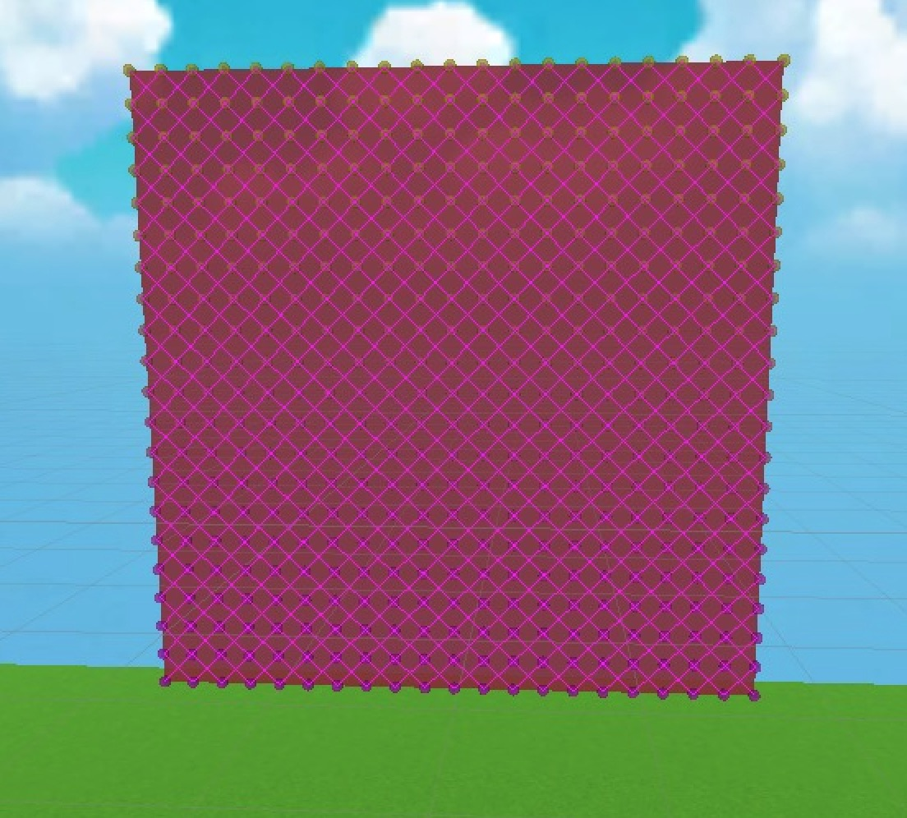
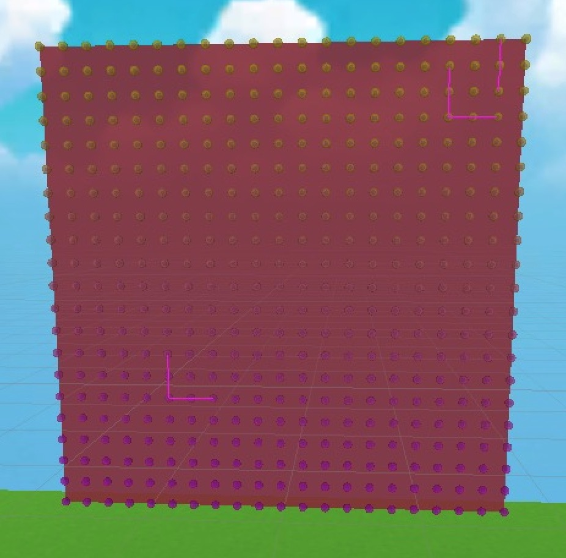

# Physically-based Simulation 2019 - FlowMo
## Introduction

*Project for the ETH course Physically-based Simulation 2019*

The Goal of our project was to creat a physically-based interctive system for games. 
It should support both soft and rigid bodies, handle collisions and provide support for user interaction (GUI, input etc.). For this reason we used Unity as a framework for rendering while writing our own physics engine.

Our engine consists of a position based dynamics system with a Verlet integration scheme. All objects are represented by particles and constraints. In each timestep, every particle's position is predicted by an explicit integration step, then the positions are readjusted to satisfy the constraints. Collisions resolution is handled in the same way, by projection. Solving for the constraints is done iteratively in a Gauss-Seidel fashion.

### Resources
The basis for our implementation was the paper by Jakobsen et al: http://www.cs.cmu.edu/afs/cs/academic/class/15462-s13/www/lec_slides/Jakobsen.pdf. 
Additional inspiration came also from Mueller et al: https://matthias-research.github.io/pages/publications/posBasedDyn.pdf

### Goals and Milestones

[Proposal presentation](media/PBS_proposal.pdf), 30. October 2019
[Milestone presentation](media/PBS_milestone.pdf), 27. November 2019
[Final presentation](media/PBS_final.pdf), 18. December 2019

## Requirements
To run the project scenes and make changes, an installation of [Unity3D](https://unity3d.com/get-unity/download) 2018 is required.
To run: Select the folder "Physics Engine and open as a project in Unity. All demo scenes can be found in Assets/scenes in the project view.

*Disclaimer: If you experience problems with some scenes, different versions of Unity can be the cause. Please contact us in this case.*

## Rigid Bodies

### **Collisions**: Sphere | Sphere
Here the two white spheres are rigid bodies from unity for comparison. The two spheres in the back are what we implemented. Shown is also the tetrahedon consisting of four particles inside the spheres used for the Verlet Simulation. 

[SphereSphereVid](media/SphereSphere.mp4)

### **Collisions**: Sphere | OBB
Here again the white cubes and the white spheres are rigid bodies from Unity for comparison with our implementation. Our implementation is on the left on the first two videos and on the right on the third video. We always visulaize the tetrahedron inside the cubes/spheres that consists of four particles. 

[ObbSphere_ComparisonVid](media/ObbSphere_Comparison.mp4)

[ObbSphere_ComparisonVid2](media/ObbSphere_Comparison2.mp4)

[SphereObb_ComparisonVid3](media/SphereObb_Comparison3.mp4)

### **Collisions**: OBB | OBB
We couldn't finish the collision detection for the OBBs completely. We invested a lot of time in this but there were still some small bugs that we were not able to fix in time. 

Here are some working examples:

[Obb_CollisionVid1](media/obb_collision1.mp4)

[Obb_CollisionVid2](media/obb_collision2.mp4)

[Obb_CollisionVid3](media/obb_collision3.mp4)

The collision resolution works perfect, however we found out that for the collision detection sometimes the hit-normal, a normal that detects the orientation the two OBBs collided from, was sometimes wrong when the OBBs were in a particular orientation to each other. Here is an example of this:

[Obb_Collision2Vid1](media/obb_coll2.mp4)

In this video the black spheres are the contact points arising from the collision between the two OBBs. The white spheres are the depth points. You can see that when going out too much the spheres start to be erronously located outside the collision surface. 

Here is a simpler example that shows the contact points and depth points correctly:

[Obb_CollisionVid1](media/obb_coll1.mp4)

### Fixed Joints
Since we work with particles we can simply fix a particle in space (invmass = 0). The constraint solver takes care of making the simulation look good.
[FixedParticle_Vid](media/FixedParticle.mp4)

## Dynamic Octree
Debug features of our Octree. We visualize for each node the contained items and for each item the parent node. This helped us a lot to find bugs.

Here we show how the tree dynamically augments its subdivisions.
[Octree Generated Mesh Vid](media/OctreeSubdivisions.mp4)

Here we show how the tree dynamically reduces its subdivisions.
[Octree Generate Mesh Removal](media/OctreeRemoval.mp4)

## Soft Bodies
We started off tackling a simple generated quad mesh. 
We create our distance constraints with tunable stiffness and damping and assign it to each pair of vertices. 

[SoftBody Generate Mesh](media/SoftBody_Start.mp4)

### Automatic generation of softbodies
We also implemented an automatic softbody constructor that generates a softbody based from the inspected mesh. 
[SoftBody Cubes with different stiffness and damping values](media/SoftBody_Group.mp4)

### SoftBodies of rigged and skinnes meshes

Moreover we implemented new type of constraints (PointConstraint) that tries to keep a particle attached to a specified point (this is then fed to our constraint solver) and an interaction manager (given by a raycast and collision between ray vs sphere).

[SoftBody Point Constraints](media/Point_Constraints.mp4)

From this we can use a rigged (for this we only intend the skeleton, so no actual professional rig is required) and skinned mesh to produce a nice soft object with a **lot** less constraints and **more stability**.

From the displacement of the constraints we compute the angle between the ideal positions and the displaced ones and change the orientation of the correct bone of the skeleton accordingly.
[SoftBody Point With Tree](media/Tree_PointConstr.mp4)

     - Open scene in Unity [Scenes/TreeInteraction]. 
     - Press play.
     - In the game view select a sphere (activate gizmos if you don't see them)
     - While holding down the mouse button move the nodes as you prefer.
     - Release to see the motion in action.

## Cloth Simulation *[Assets/Scenes/Cloth]*

In out physics engine we also implemented a Cloth Simulator.
You can set the different parameters manually and generate a cloth.

### This is the main structure of our cloth simulator
Structural constraints     |  Shear constraints        |  Bending constraints (samples)
:-------------------------:|:-------------------------:|:-------------------------:
  |       | 

### Example with a subset of the constraints and very low stiffness.
[Low stiffness cloth with subset of constraints](media/Cloth_OnlyStructuralAndShearConstraints.mp4)

### Cloth collision
We enabled OBBs and Spheres to collide with the cloth. For this we required to change the way we handle the resolution because until this points we had to solve a linear system to compute the displacement coefficients for each particle in our tetrahedron structure.

Example:
Cloth:
[Collision sphere cloth](media/ClothCollision3.mp4)

Stiff Cloth:
[Higher stiffness cloth](media/ClothCollision5.mp4)

     - Open scene in Unity [Scenes/Cloth]. 
     - Press play.
     - Select parameters by dragging sliders.
     - Press generate.
     - (For collisions enable a sphere or obb in the scene placed inside VerletSim)

## Interactivity
To give an example of a game we developed a small mini-golf/billiards game.
The goal is to push all the balls in the scene past the obstacles into the hole by shooting white balls into the scene. The camera viewpoint can be moved by mouse and WASD/QX. Press SPACE to shoot, holding down longer to increase the ball's initial forward velocity.

*This scene can be found on the branch interaction.*

[GameVideo1](media/game1.mp4)
[GameVideo2](media/game2.mp4)

## Final Scene
[Final Cutscene](media/pbs_trailer.mp4)

## Authors
Nihat Isik

Marion Deichmann

Qais El Okaili

